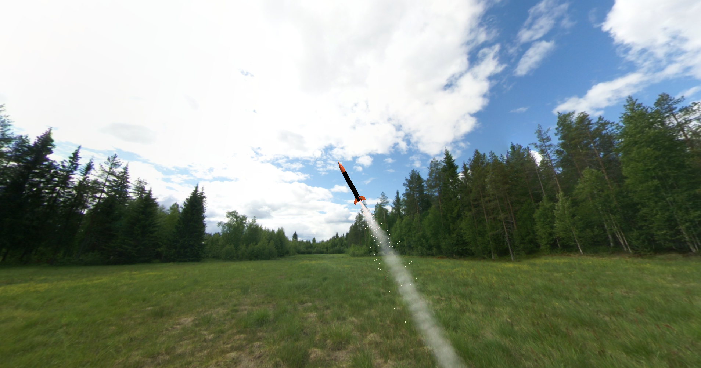
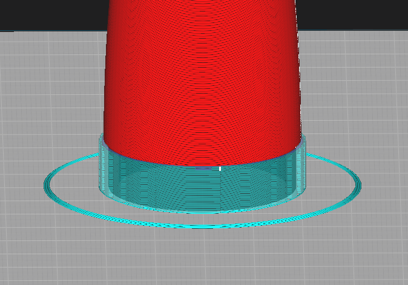
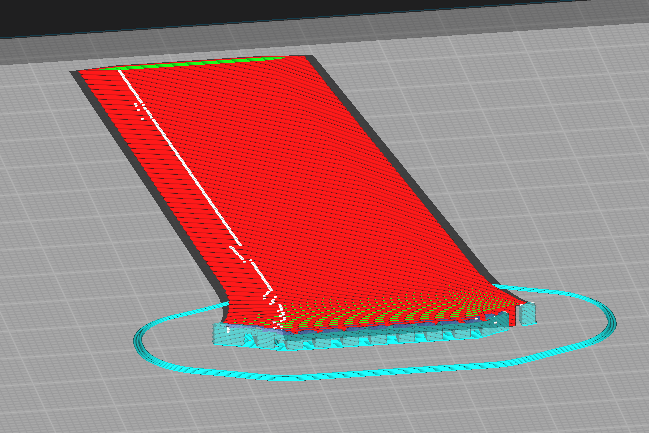

# Ember

A cheap,diy model rocket with a flight recorder

# Stuff needed

1. 3d printer
2. 1.5 inch cardboard tube

# Models 

Its suggested to just 3d print everything needed to make the rocket (expect the rocket body)

Recommended print settings:

Layer heigh  -> 0.2mm
Wall lines -> 5
Infill -> Gyroid 40%
Top & Bottom layers -> 4

1. Nose cone
- Add normal supports for the lip in the shoulder. It should come off easily

2. Fins (4)
- Print it with the fin tab facing the bed and with the `Seam corner preference` set to `Hide Seam`

3. Launch lugs (2)
4. Engine block
5. Centering rings (2)

# TODO
* Rocket design
* CAD Models
* Launch controller
* Flight recorder
* Fin jig, launch pad