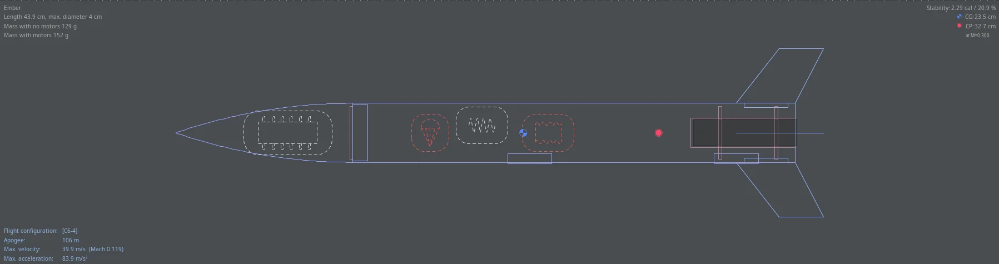
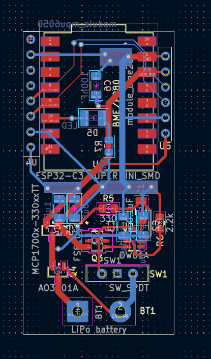
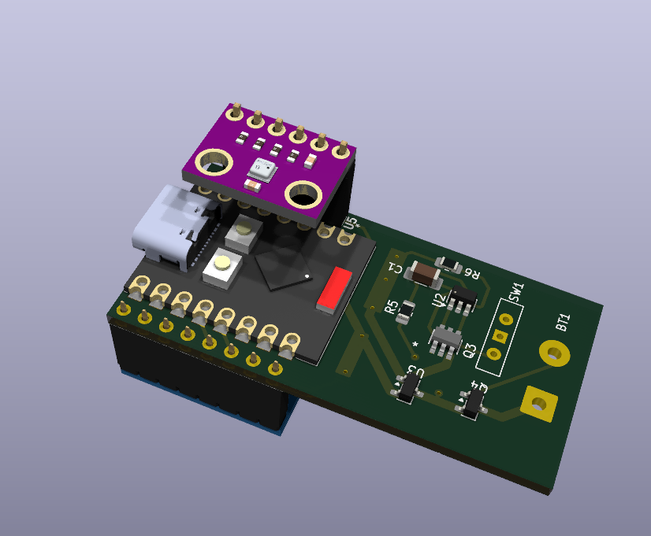
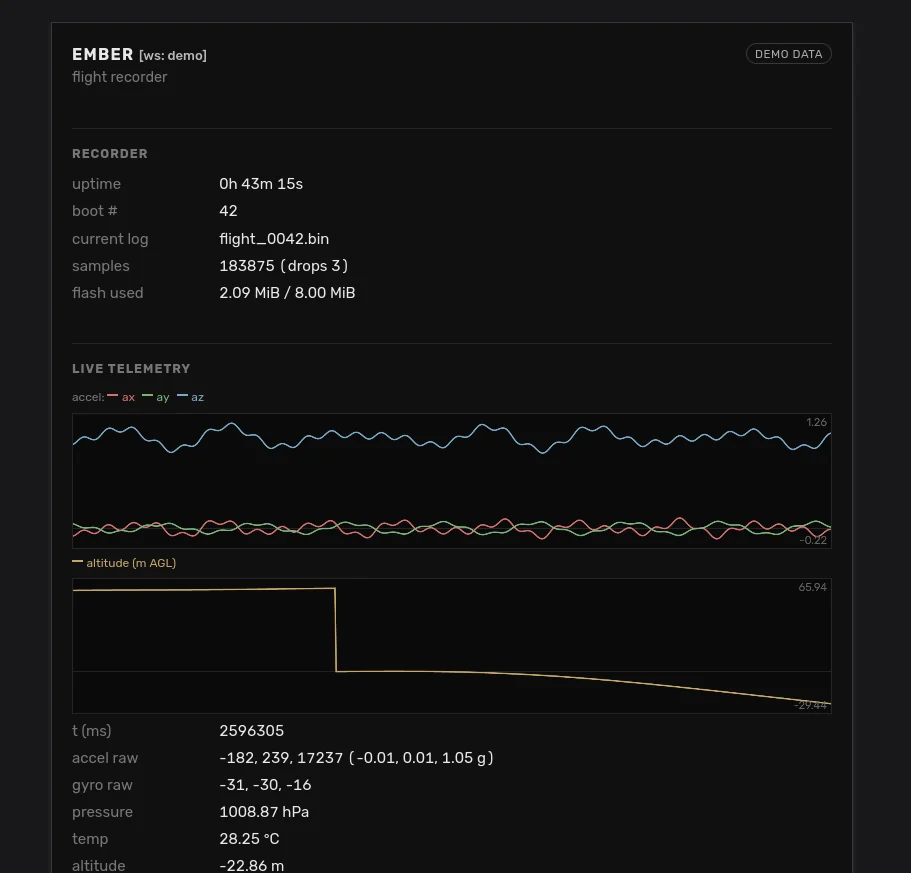
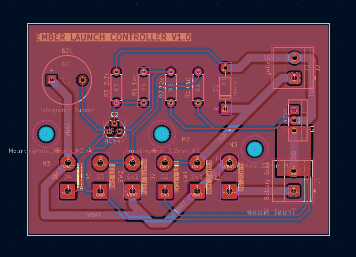
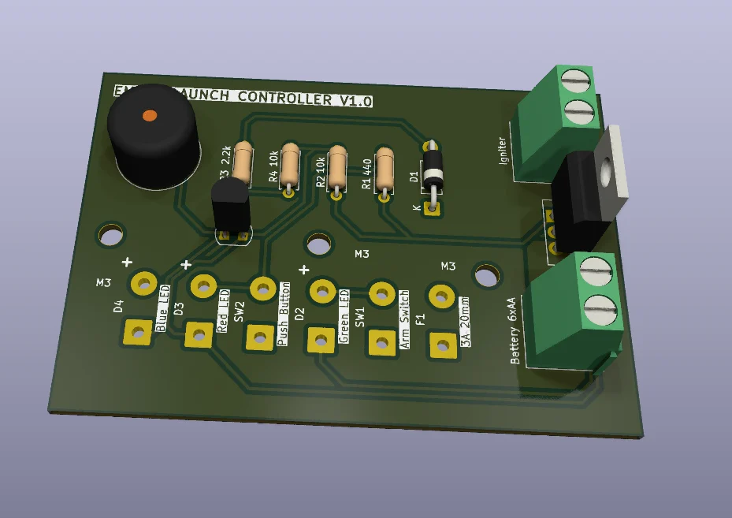

<a id="readme-top"></a>

[![Contributors][contributors-shield]][contributors-url]
[![Forks][forks-shield]][forks-url]
[![Stargazers][stars-shield]][stars-url]
[![Issues][issues-shield]][issues-url]
[![project_license][license-shield]][license-url]


<br />
<div align="center">
<h3 align="center">Ember</h3>

  <p align="center">
    A cheap, diy model rocket with a flight recorder and everything else you would need to fy it
    <br />
    <a href="https://github.com/HexDump0/Ember"><strong>See the guide »</strong></a>
    <br />
    <br />
    <a href="#">Video (Soon)</a>
    &middot;
    <a href="https://github.com/HexDump0/Ember/tree/master/models">Models</a>
    &middot;
    <a href="https://github.com/HexDump0/Ember/tree/master/gerber">Gerber</a>
    &middot;
    <a href="https://github.com/HexDump0/Ember/releases/tag/v1.0">Firmware</a>
  </p>
</div>

## About The Project


Ember is a diy, cheap and open source model rocket along with everything you would need to launch it + detailed guides on actually building it

<p align="right">(<a href="#readme-top">back to top</a>)</p>


## Images

<a href="images/openrocket.png"></a>

|  | | |
|:---------------:|:------------------:|:---------:|
| <a href="images/flight_recorder.png"></a><br><sub>Flight Recorder</sub> | <a href="images/flight_recorder_3d.png"></a><br><sub>Flight Recorder 3D</sub> | <a href="images/dash.png"></a><br><sub>Dashboard</sub> |
| <a href="images/launch_controller.png"></a><br><sub>Launch Controller</sub> | <a href="images/launch_controller_3d.png"></a><br><sub>Launch Controller 3D</sub> |  |


## Guide

### 3D Printing
A few of the important parts of the rocket are 3d printed, you could get away with using PLA for them but ABS is better if you have it.

Recommended print settings:
- Layer heigh  -> 0.2mm
- Wall lines -> 5
- Infill -> Gyroid 40%
- Top & Bottom layers -> 4

### Nose cone
Add normal supports for the lip in the shoulder. It should come off easily


### Fins x4
Print it with the fin tab facing the bed and with the `Seam corner preference` set to `Hide Seam`


### Launch lugs x2
### Engine block
### Centering rings x2
### Launch Controller Body/Panel
### Launch Pad Leg/Body

You can just print these with the recommenced settings 


### PCB/Electronics

The gerber files for both the launch controller and flight recorder are available [here](https://github.com/HexDump0/Ember/tree/master/gerber)

Make sure you would a bit of 22 AWG wires at hand for the panel lights and switches

The Battery is meant to be charged on the bench and then soldered on to the flight recorder

(More detailed guide will come once I get my PCBs)

### Flashing the firmware

You need [`esptool`](https://docs.espressif.com/projects/esptool/). Install it using

```sh
pip install --user esptool
```

Plug the Super Mini into USB. It should show up as `/dev/ttyACM0` on Linux,
`/dev/tty.usbmodem*` on macOS, and `COMx` on Windows

Flash the [firmware](https://github.com/HexDump0/Ember/releases/tag/v1.0) using

```sh
esptool --chip esp32c3 --port /dev/ttyACM0 --baud 460800 \
        write-flash 0x0 ember.bin
```

Once done you should see some logs in serial

```sh
# pick one
idf.py -p /dev/ttyACM0 monitor
miniterm /dev/ttyACM0 115200
screen /dev/ttyACM0 115200
```
```
I (xxx) ember: ember boot
I (xxx) sensors: MPU6050 ready @0x68
I (xxx) sensors: BMP280 ready @0x76 ...
I (xxx) httpd: http server up on :80
I (xxx) wifi_ap: softap up: ssid=ember-XXXXXX ch=1
```

Connect to the open Wi-Fi `ember-XXXXXX` and visit
<http://192.168.4.1> for the dashboard.

## License

Distributed under the Creative Commons Attribution-NonCommercial 4.0. See `LICENSE.md` for more information.

<p align="right">(<a href="#readme-top">back to top</a>)</p>


## Contact

HexDump0 - [@HexDump0](https://x.com/hexdump0) - root@hexdump0.pw

Project Link: [https://github.com/HexDump0/Ember](https://github.com/HexDump0/Ember)

<p align="right">(<a href="#readme-top">back to top</a>)</p>


## Acknowledgments

* [SnapEDA](https://www.snapeda.com) for ESP32-C3 SMD Footprint and Symbol
* [UltraLibrarian](https://www.ultralibrarian.com) for FS8205A Footprint and Symbol
* [RabchikEngineer](https://github.com/RabchikEngineer) for KiCad ESP32-C3-SuperMini symbols
* [Ulf Hille](https://grabcad.com/library/esp32c3-supermini-1) for ESP32C3 SuperMini 3D Model
* [Usini](https://ko-fi.com/usini) for Usini Sensors Kicad Schematics and footprints (and associated GrabCAD authors)

<p align="right">(<a href="#readme-top">back to top</a>)</p>


[contributors-shield]: https://img.shields.io/github/contributors/HexDump0/Ember.svg?style=for-the-badge
[contributors-url]: https://github.com/HexDump0/Ember/graphs/contributors
[forks-shield]: https://img.shields.io/github/forks/HexDump0/Ember.svg?style=for-the-badge
[forks-url]: https://github.com/HexDump0/Ember/network/members
[stars-shield]: https://img.shields.io/github/stars/HexDump0/Ember.svg?style=for-the-badge
[stars-url]: https://github.com/HexDump0/Ember/stargazers
[issues-shield]: https://img.shields.io/github/issues/HexDump0/Ember.svg?style=for-the-badge
[issues-url]: https://github.com/HexDump0/Ember/issues
[license-shield]: https://img.shields.io/github/license/HexDump0/Ember.svg?style=for-the-badge
[license-url]: https://github.com/HexDump0/Ember/blob/master/LICENSE.md 
